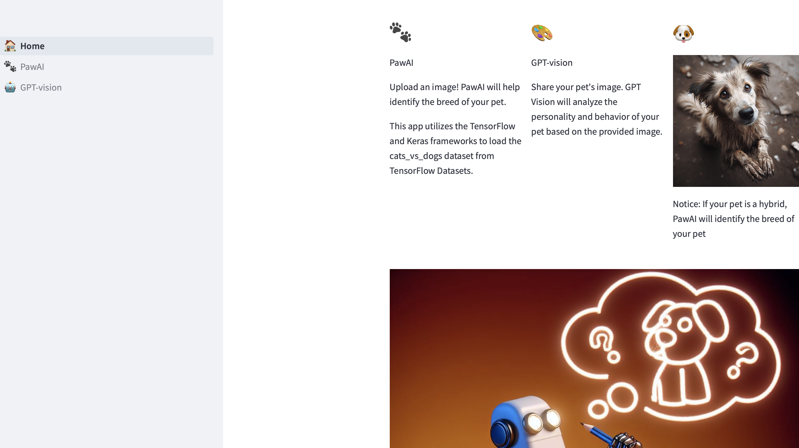
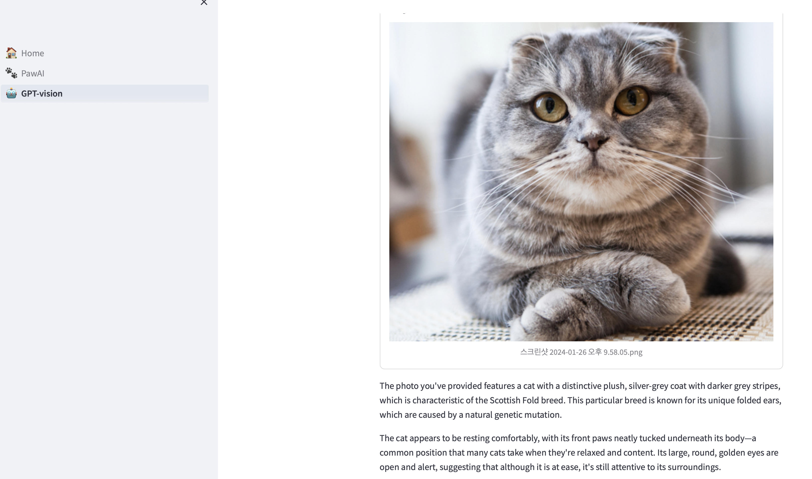

# PawAI 🐕 🐾

**PawAI (ResNet50)**: Designed to identify your pet's breed, this model is recommended for cases where you are unsure about your pet's breed.

**GPT-Vision (Prompt-Tuning)**: The GPT-Vision module has been fine-tuned with prompt-tuning capabilities. By uploading your pet's image, GPT will analyze both your pet's overall condition and accurately determine its breed.
## Cat vs Dog classifier

### ResNet50
: Residual Neural Network

### PlainNet &rightarrow; ResNet

References:

[Data resource](https://www.tensorflow.org/datasets/catalog/cats_vs_dogs)
[Paper](https://arxiv.org/pdf/1409.1556.pdf)
## GPT-VISION
## Examples: 

